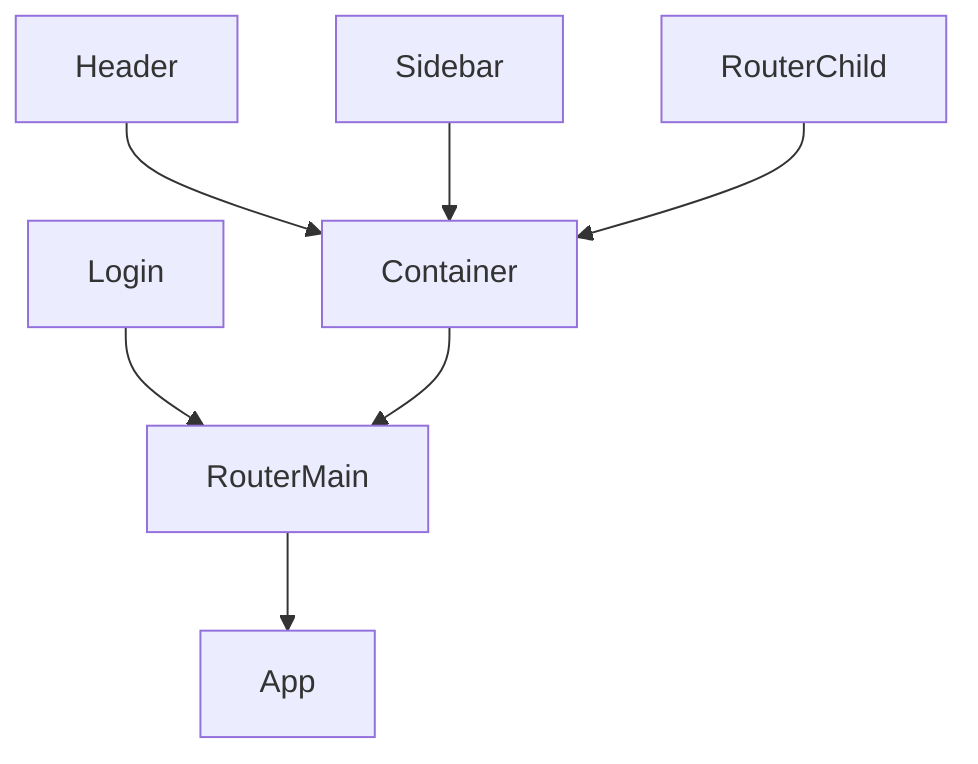

# Gerege Control Panel V3

Blank control panel for web development team.

```
* vue           3.0
* vuex          4.0
* vue-router    4.0
* tailwindcss   2.0
```

### Start project

```
1. git clone https://gitlab.gerege.mn/bayarsaikhan/control-panel-boilerplate.git
2. cd control-panel-boilerplate
3. code .
4. npm install
5. npm run start
6. npm run build
```

### Component Structure

Хуудсууд [RouterChild](src/router/index.js) дээр солигдож render-лэгдэнэ.



## Documents

### Components

- Common
  - [x] [Button](documents/button.md)
  - [x] [Dropdown](documents/dropdown.md)
  - [x] [Icon](documents/icon.md)
  - [ ] [Divider]()
  - [ ] [Loader]()
- Form
  - [ ] [Form]()
  - [ ] [Input]()
  - [ ] [Select]()
  - [ ] [Textarea]()
  - [ ] [Option box]()
  - [ ] [Check box]()
- Feedback
  - [x] [Alert](documents/alert.md)
  - [x] [Notification](documents/notification.md)
  - [x] [Modal](documents/modal.md)
- Data
  - [x] [Data table](documents/datatable.md)
  - [x] [Pagination](documents/pagination.md)
  - [x] [Tree](documents/tree.md)
  - [x] [Panel](documents/panel.md)

### Colors

- `#71717A` gray
- `#EF4444` red
- `#F59E0B` yellow
- `#10B981` green
- `#3B82F6` blue
- `#6366F1` indigo
